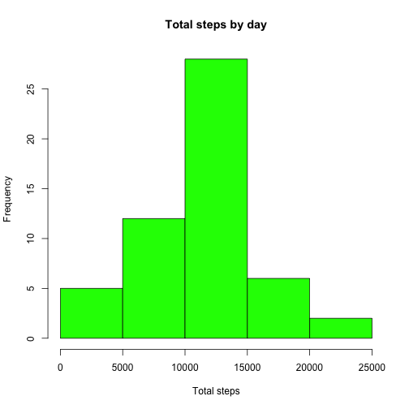

Analyzing activity monitoring data
===================================

# Preparing the data
First we load the data from the CSV file into R

```r
library(dplyr)
rawdata <- read.csv("activity.csv")
cleandata <- rawdata[!is.na(rawdata$steps),]
```


#What is mean total number of steps taken per day?
\
**First:** Group the cleaned data by date and sum the total steps per day.

```r
grp <- group_by(cleandata, date)
stepsSummedByDate <- summarise(grp, sum=sum(steps))
```
\
**Second:** Draw a histogram showing the total steps taken per day.

```r
stepsSummedByDate$date <- as.numeric(stepsSummedByDate$date) 
hist(x = stepsSummedByDate$sum, xlab = "Total steps", col="green", main="Total steps by day")
```

 
\
**Third:** calculate the mean and median of the steps taken per day
*Mean:*

```r
mean(stepsSummedByDate$sum)
```

```
## [1] 10766.19
```
*Median:*

```r
median(stepsSummedByDate$sum)
```

```
## [1] 10765
```

#What is the average daily activity pattern?
\
**First:** Time series plot for the average steps across days
1- Group the cleaned data by interval and average the total steps per day.
2- Create the plot

```r
grp2 <- group_by(cleandata, interval)
stepsSummedByInterval <- summarise(grp2, avgsteps=mean(steps))
plot(x= stepsSummedByInterval$interval , y=stepsSummedByInterval$avgsteps, xlab="Time Interval", ylab="Average steps", main="5-minute Time series plot for avg. number of steps across days", type="l")
```

 
\
**Second:** Which 5-minute interval, on average across all the days in the dataset, contains the maximum number of steps?


```r
stepsSummedByInterval[which(stepsSummedByInterval$avgsteps==  max(stepsSummedByInterval$avgsteps)), "interval"]
```

```
## Source: local data frame [1 x 1]
## 
##   interval
## 1      835
```
\
#Imputing missing values
**First** Calculate and report the total number of missing values in the dataset (i.e. the total number of rows with NAs)

```r
sum(is.na(rawdata$steps))
```

```
## [1] 2304
```
\
**Second** Devise a strategy for filling in all of the missing values in the dataset. The strategy does not need to be sophisticated. For example, you could use the mean/median for that day, or the mean for that 5-minute interval, etc.

We can see that the avg. number of steps differ according to the daily cycle. So we can calculate the median number of steps for each interval across all days and use it to fill the days where that particular interval value was missing.
By using median we can avoid the effect that might happen from extreme values or outliers.
\
**Third** Create a new dataset that is equal to the original dataset but with the missing data filled in.

```r
FilledSet <- rawdata[,]
FilledSet$steps[is.na(FilledSet$steps)] <- with(FilledSet, ave(steps, interval, 
   FUN = function(x) median(x, na.rm = TRUE)))[is.na(FilledSet$steps)]
```
\
**Fourth** Make a histogram of the total number of steps taken each day and Calculate and report the mean and median total number of steps taken per day.  What is the impact of imputing missing data on the estimates of the total daily number of steps?

```r
grp.FilledSet <- group_by(FilledSet, date)
stepsSummedByDate.FilledSet <- summarise(grp.FilledSet, sum=sum(steps))
stepsSummedByDate.FilledSet$date <- as.numeric(stepsSummedByDate.FilledSet$date) 
hist(x = stepsSummedByDate.FilledSet$sum, xlab = "Total steps", col="green", main="Total steps by day")
```

 
\
**Discussion:**Do these values differ from the estimates from the first part of the assignment?
From the graph above, we can see that the values differed from the earlier estimate where the gaps where not filled.
What is the impact of imputing missing data on the estimates of the total daily number of steps?
We can also see that the total number of steps has *increased* due to the imputation step. This comes as no surprise as we have replaced some missing values with a number that can't be less tahn zero. However, we can also notice that the effect is more predominant on the lower side of the histogram. This is also logical as the added number of steps is more likely to affect the days with lower number of steps (in absolute terms) than it is with those days that have higher values.

#Are there differences in activity patterns between weekdays and weekends?
\
**First** we calculate the weekdays from the filled-in dataset


```r
FilledSet$weekdays <- weekdays(as.POSIXlt(FilledSet$date,format="%Y-%m-%d"))
```
\
**Second:**Create a new factor variable in the dataset with two levels – "weekday" and "weekend" indicating whether a given date is a weekday or weekend day.
We only need to distinct between the weekend/weekday rather than the exact day. Thus we replace the extracted day with the value "weekend" or "weekend"

```r
FilledSet$weekdays[!FilledSet$weekdays %in% c('Saturday','Sunday')]<- "weekday" 
FilledSet$weekdays[FilledSet$weekdays %in% c('Saturday','Sunday')]<- "weekend"
```
\
**Third:** Creating a Panel plot containing a time series plot of the 5-minute interval (x-axis) and the average number of steps taken, averaged across all weekday days or weekend days (y-axis). 

```r
library(ggplot2)
FilledSetStepsSummedByInterval <- summarise(group_by(FilledSet, interval, weekdays), averagesteps=mean(steps))
qplot(x=interval, y= averagesteps,xlab="Time Interval", ylab="Average steps", main="5-minute Time series plot for avg. number of steps across weekdays", facets=weekdays~., data=FilledSetStepsSummedByInterval, geom="line")
```

 

